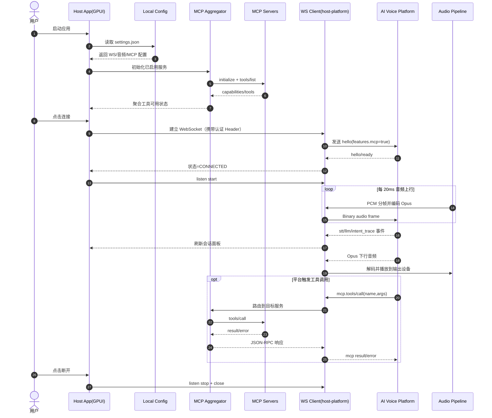

# AI Meeting Host (`conference-hosting`)

AI Meeting Host 是一个面向在线会议场景的桌面语音网关。

它把“本机会议音频设备”与“AI 语音平台”连接起来，让 AI 能在会议中实时听、答、说。

## 产品定位

- 一个运行在本机的 Voice Gateway，而不是某个会议软件插件
- 一个可观测、可调试、可扩展（支持 MCP）的 AI 会议托管客户端
- 当前版本：`v0.1.0-alpha`（主链路已可运行，适合联调与验证）

## 当前版本已实现

- WebSocket 双向主链路：`hello` 握手、`listen start/stop/detect`、文本事件、二进制音频帧
- 实时音频通路：采集 -> 20ms 分帧 -> Opus 上行 -> Opus 下行解码 -> 输出设备播放
- 会话面板：STT/LLM/TTS 聚合展示、`intent_trace` 调用链折叠、响应时延与 RTT 展示
- 音频路由：输入/输出设备选择、输出回采（loopback）作为输入、采集/播放开关
- 回声控制：AEC3 实时处理，输入/输出同路由时自动强制开启
- MCP 集成：支持 `stdio/sse/stream` 三种 server，支持探测、tools 刷新与路由调用
- 本地持久化：WS 配置、UI 偏好、MCP 列表自动保存并恢复

## 协议兼容说明

- 当前软件默认接入灵矽平台（`https://linx.qiniu.com/`）对应的 WebSocket 协议族（实际服务地址可通过 `HOST_WS_URL` 覆盖）
- 该协议在 xiaozhi WebSocket 协议基础上做了增强，扩展了部分能力字段与事件语义（如 `features.mcp`、`intent_trace`）
- 同时保持与 `xiaozhi-server` 开源版本协议兼容，`hello/listen/音频帧` 主链路可直接互通

## 典型使用方式

1. 配置 WS 地址和认证信息，连接 AI 语音平台。
2. 选择输入/输出音频设备（可选 loopback 采集会议下行）。
3. 通过语音上行 + 文本/工具事件观察 AI 会话过程。
4. 在设置页管理 MCP Servers，扩展 AI 可调用工具。

## 当前软件时序图



## 快速开始

```bash
cargo fetch
cargo run -p host-app-gpui
```

首次运行建议：

1. 打开设置，填写 WS 地址和 Token。
2. 选择输入/输出设备（若需回采会议声音，选择 loopback 输入源）。
3. 点击连接，状态变为 `CONNECTED` 后开始联调。

> 提示：`HOST_TOKEN` 未设置时会使用占位值 `your-token1`，通常无法通过真实服务鉴权。

## 可选环境变量

- `HOST_WS_URL`：WS 地址（默认 `wss://xrobo-io.qiniuapi.com/v1/ws/`）
- `HOST_DEVICE_ID` / `HOST_DEVICE_MAC` / `HOST_DEVICE_NAME`
- `HOST_CLIENT_ID`：未设置时自动生成 32 位无符号 UUID
- `HOST_TOKEN`
- `HOST_INPUT_DEVICE`：输入设备名或关键字
- `HOST_OUTPUT_DEVICE`：输出设备名或关键字
- `HOST_ENABLE_AEC`：是否启用 AEC（默认启用）
- `HOST_ENABLE_INPUT_MONITOR`：是否将输入流镜像到系统扬声器（默认关闭）
- `HOST_ENABLE_OUTPUT_MONITOR`：是否将选中输出镜像到系统扬声器（默认关闭）
- `HOST_APP_CONFIG_PATH`：覆盖本地配置文件路径

默认本地配置路径：

- `~/.conference-hosting/host-app-gpui/settings.json`

## 工程结构（按职责划分）

- `apps/host-app-gpui`：桌面应用层（连接、设备、会话、设置、MCP 管理）
- `crates/host-platform`：平台适配层（WS 客户端、握手、事件流、传输错误处理）
- `crates/host-core`：领域模型与协议（`hello/listen/mcp`、音频常量）
- `docs/ai_meeting_hosting_design.md`：产品与架构设计说明

## 常用命令

```bash
cargo build --workspace
cargo fmt --all -- --check && cargo clippy --workspace --all-targets -- -D warnings
cargo test --workspace
cargo test -p host-core gateway_status_toggle_switches_between_states
```

## 应用图标与打包

- 图标源文件：`apps/host-app-gpui/assets/svg/app-taskbar-logo.svg`
- 已生成图标：`apps/host-app-gpui/assets/icons/app-taskbar-logo.icns`、`apps/host-app-gpui/assets/icons/app-taskbar-logo.ico`

重新导出图标（SVG -> PNG/ICO/ICNS）：

```bash
bash apps/host-app-gpui/scripts/build_app_icons.sh
```

生成 macOS `.app` 包（Dock 显示自定义图标）：

```bash
bash apps/host-app-gpui/scripts/package_macos_app.sh
```

输出路径：`apps/host-app-gpui/dist/AI Meeting Host.app`

Windows 下执行 `cargo build -p host-app-gpui --release` 时，会通过 `build.rs`
将 `assets/icons/app-taskbar-logo.ico` 嵌入 exe 资源（任务栏图标）。

## GitHub Actions 自动打包（macOS）

仓库内置工作流：`.github/workflows/release-macos-on-tag.yml`。

当 tag 被 push 到远端后，会自动：

- 在 `macos-14` runner 上构建并打包 `AI Meeting Host.app`
- 生成 `AI-Meeting-Host-<tag>-macos.zip` 和同名 `.sha256` 校验文件
- 上传 workflow artifact，并发布到同名 GitHub Release（自动生成 Release Notes）

触发示例：

```bash
git tag v0.1.1
git push origin v0.1.1
```

## 当前边界

- 虚拟麦克风自动化编排（BlackHole/VB-Cable 等）仍需手动配合系统路由
- VAD 打断策略、跨平台签名分发与安装器流程仍在推进中
